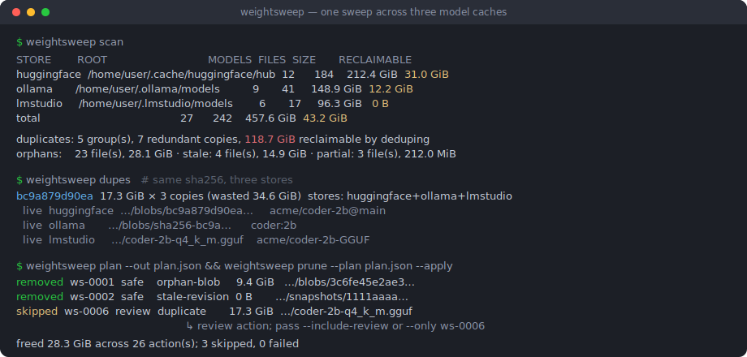
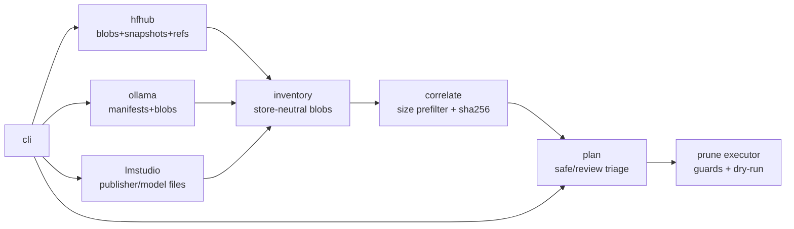

# weightsweep

[English](README.md) | [中文](README.zh.md) | [日本語](README.ja.md)

[](LICENSE) [](go.mod) [](CHANGELOG.md)  [](CONTRIBUTING.md)

**weightsweep：Hugging Face・Ollama・LM Studio のキャッシュを対象とするオープンソースのディスクアナライザ——3 つのストアを横断して blob をコンテンツハッシュで突き合わせ、重複・孤児・失効リビジョンをレビュー可能かつ安全に実行できる削減プランへまとめる。**



```bash
git clone https://github.com/JaydenCJ/weightsweep.git && cd weightsweep && go install ./cmd/weightsweep
```

> プレリリース：v0.1.0 はまだ module proxy tag を公開していないため、上記の手順でソースからインストールしてください。静的バイナリ 1 つ、ランタイム依存ゼロ、ネットワークゼロ——weightsweep はファイルシステムを読むだけです（削除するのも承認済みプランに書かれた内容だけ）。

## なぜ weightsweep？

ローカル AI 環境は、誰も気づかないうちに同じモデルを 3 回溜め込みます：Hugging Face hub キャッシュは LFS blob を sha256 名で `models--org--name/blobs/` に置き、Ollama はバイト単位で同一の GGUF を `blobs/sha256-…` レイヤーとして保存し、LM Studio は `publisher/model/` の下にもう 1 部を素のファイルとして持ちます。各ツールはせいぜい自分のストアしか見られず——`hf cache scan` は hub キャッシュだけ、`ollama list` は manifest だけ——24 GiB の重みが三重に存在すること、共有 manifest に留められた blob が前回の `ollama rm` を生き延びたこと、更新後に旧リビジョンの snapshot が数 GiB を座礁させたままなことは、どれも教えてくれません。weightsweep は 3 つのレイアウトすべてを走査し、sha256 で blob を突き合わせ（ファイル名がハッシュのストアはコストゼロ、それ以外はサイズ衝突時のみ計算）、削減プランを出力します。各アクションは **safe**（孤児、中断ダウンロード、切り離された snapshot の骨格）か **review**（重複コピー、失効リビジョンの blob）に分類——デフォルトは dry-run で、改ざんされたパスや計画後に変化したファイルから守られます。

| | weightsweep | hf cache scan / delete | ollama list / rm | du / ncdu |
| --- | --- | --- | --- | --- |
| 対象ストア | HF hub + Ollama + LM Studio | HF hub のみ | Ollama のみ | バイトのみ、意味は不明 |
| ストア横断の重複検出 | sha256、サイズ事前フィルタ付きハッシュ | なし | なし | なし |
| 孤児 blob の検出 | 3 レイアウトすべて | なし（リビジョン単位のみ） | `rm` 時・自ストアのみ | なし |
| 失効 HF リビジョンの扱い | フラグ付け + 削減可、カスケードも説明 | 対話式 delete-revisions | 対象外 | なし |
| 削除の安全性 | プランファイル、既定 dry-run、サイズ/ルート防護 | 即時削除 | 即時削除 | 手動 `rm` |
| 破損チェック | `--verify` が名前アドレス blob を再ハッシュ | なし | なし | なし |

<sub>比較は 2026-07 時点の各上流ドキュメントに基づく。huggingface_hub の `hf cache scan/delete` と Ollama CLI はそれぞれ自分のストアだけを管理し、ツール横断でコンテンツを突き合わせることはない。</sub>

## 特徴

- **3 つのキャッシュレイアウトを 1 つのインベントリに** —— HF hub の構造（blobs / snapshots / refs）、Ollama の OCI 風 manifest + コンテンツアドレス blob、LM Studio の素の `publisher/model` ツリーを、ストア中立のモデルへ統合。
- **ディスクをいたわるハッシュ突合** —— HF LFS と Ollama の blob はファイル名に sha256 を持つ（readdir 1 回、読み取り不要）。それ以外はバイトサイズが他の blob と正確に衝突したときだけハッシュされ、孤立した 40 GiB の GGUF に触れることはない。
- **正直な生存分類** —— 各ファイルは `live`、`stale`（切り離された HF リビジョンだけがリンク）、`orphan`（参照なし）、`partial`（中断ダウンロード）のいずれかで、参照元モデル名も表示。
- **不意打ち削除ではなく削減プラン** —— `plan` はバージョン付き JSON を書き出し、アクションを safe/review に分類。`prune` は `--apply` なしなら dry-run、review アクションは `--include-review` か明示的な `--only ws-0007` がない限りスキップし、プランに記録されたストアルート外のパスや計画後にサイズが変わったファイルを拒否する。
- **破損検出を内蔵** —— `scan --verify` は名前アドレスの全 blob を再ハッシュし、バイト列が宣言ダイジェストと一致しないファイルを報告、重複グループに混ざる前にダイジェストを修正する。
- **依存ゼロ・ネットワークゼロ** —— 純粋な Go 標準ライブラリ、静的バイナリ 1 つ。自身のテストは 91 のオフラインケースとエンドツーエンドの smoke スクリプトで、リポジトリは意図的に CI を持たない。

## クイックスタート

実際のキャッシュを直接指定できます（既定：`$HF_HUB_CACHE` または `~/.cache/huggingface/hub`、`$OLLAMA_MODELS` または `~/.ollama/models`、`~/.lmstudio/models`）——まず同梱のデモツリーを作っても構いません：

```bash
bash examples/make-demo-caches.sh
weightsweep --hf demo-caches/hf/hub --ollama demo-caches/ollama/models \
            --lmstudio demo-caches/lmstudio/models scan
```

実際にキャプチャした出力（デモツリーより）：

```text
STORE        ROOT                                        MODELS  FILES  SIZE      RECLAIMABLE
huggingface  /home/user/lab/demo-caches/hf/hub           2       5      37.0 MiB  13.0 MiB
ollama       /home/user/lab/demo-caches/ollama/models    1       4      27.0 MiB  3.0 MiB
lmstudio     /home/user/lab/demo-caches/lmstudio/models  1       1      24.0 MiB  0 B
total                                                    4       10     88.0 MiB  16.0 MiB

duplicates: 1 group(s), 2 redundant copies, 48.0 MiB reclaimable by deduping
orphans:    2 file(s), 8.0 MiB · stale: 1 file(s), 8.0 MiB · partial: 2 file(s), 10 B
hashed 1 file(s) (24.0 MiB) to correlate size collisions
next: weightsweep plan --out plan.json && weightsweep prune --plan plan.json
```

プランを書き出し、レビューし、実行——safe アクションは削除され、review アクションは明示的な同意を待ちます（実出力、一部の行を省略）：

```text
$ weightsweep --hf … plan --out plan.json
plan: 8 action(s), 64.0 MiB total
  safe:   5 action(s), 8.0 MiB (orphans, partials, stale skeletons)
  review: 3 action(s), 56.0 MiB (stale blobs, duplicate copies)
wrote plan.json

$ weightsweep --hf … prune --plan plan.json --apply
removed  ws-0001  safe    orphan-blob       5.0 MiB   …/hf/hub/models--acme--retired-model/blobs/3c6fe45e2ae3…
removed  ws-0003  safe    partial-download  7 B       …/hf/hub/models--acme--coder-2b/blobs/bc9a879d90ea…0000.incomplete
removed  ws-0005  safe    stale-revision    0 B       …/hf/hub/models--acme--coder-2b/snapshots/1111aaaa1111aaaa1111
skipped  ws-0006  review  duplicate         24.0 MiB  …/lmstudio/models/acme/coder-2b-GGUF/coder-2b-q4_k_m.gguf
                                                      ↳ review action; pass --include-review or --only ws-0006
freed 8.0 MiB across 5 action(s); 3 skipped, 0 failed
```

`dupes` と `orphans` は同じ詳細を焦点別レポートとして提供し、すべてのコマンドはスクリプト用に `--json` を受け付けます。

## 分類と安全レベル

| 分類 | 意味 | プラン上の扱い |
| --- | --- | --- |
| `live` | ref 付き HF リビジョン、Ollama manifest、LM Studio モデルディレクトリのいずれかが参照 | プラン対象外 |
| `orphan` | 何も参照していない（残留レイヤー、未リンク blob） | `safe` |
| `partial` | 中断ダウンロード（`.incomplete`、`-partial`、`.tmp` など） | `safe` |
| `stale` | 切り離された HF リビジョン（ref なし）だけがリンク | `review` |
| 重複コピー | 同じ sha256 が他所に存在。そのツールは次回使用時に再ダウンロード | `review` |

失効 snapshot の骨格を削除すると、それだけが参照していた blob は次回スキャンで孤児に降格します——もう一度 `plan` を実行すれば safe アクションとして回収できます（このカスケードは意図的な設計で、各ステップが独立にディスクと照合可能です）。

## コマンドとフラグのリファレンス

| Key | Default | Effect |
| --- | --- | --- |
| `--hf`・`--ollama`・`--lmstudio` | 環境変数、次にホームディレクトリ規約 | 走査するストアルート |
| `--hash` | `auto` | `auto` はサイズ衝突のみハッシュ。ほかに `always` / `never` |
| `--min-size` | `0` | このサイズ未満の blob（`100MiB`、`1.5GiB` など）を重複グループとプランの対象から除外 |
| `scan --verify` | off | 名前アドレス blob を再ハッシュ。破損検出時は終了コード 1 |
| `plan --out` | stdout | プラン JSON の書き出し先 |
| `prune --plan` | 必須 | 実行するプラン。`--apply` なしなら dry-run |
| `prune --include-review` / `--only ID` | off | review レベルのアクションへの同意 |

終了コード：`0` 正常 · `1` 要確認の検出あり（破損、prune 失敗） · `2` 使い方エラー。

## アーキテクチャ



3 つのスキャナは読むだけ。相関器は可能な限りハッシュを避け、削除するのはプラン実行器のみ——それもプラン自身が記録したルートの内側だけです。

## ロードマップ

- [x] v0.1.0 —— HF hub・Ollama・LM Studio を横断する scan/dupes/orphans/plan/prune。サイズ衝突事前フィルタ付き sha256 突合。safe/review 分類と防護付き実行。`--verify` 破損チェック。JSON 出力。テスト 91 件 + smoke スクリプト
- [ ] ハードリンク/reflink による重複排除モード：1 部を残し他はリンク化（同一ファイルシステム）
- [ ] GGUF ヘッダの読み取りで、重複グループに量子化とパラメータ数を表示
- [ ] 追加ストア対応：llama.cpp のダウンロードディレクトリ、vLLM キャッシュ、GPT4All
- [ ] `plan --interactive`：review アクションをターミナルで対話選択
- [ ] Windows 対応（パス規約、LM Studio の既定配置）

全リストは [open issues](https://github.com/JaydenCJ/weightsweep/issues) を参照。

## コントリビュート

バグ報告・キャッシュレイアウトの訂正・pull request を歓迎します——ローカルの作業手順は [CONTRIBUTING.md](CONTRIBUTING.md)（`go test ./...` と、`SMOKE OK` を出力する `scripts/smoke.sh`）。入門タスクには [good first issue](https://github.com/JaydenCJ/weightsweep/issues?q=is%3Aissue+is%3Aopen+label%3A%22good+first+issue%22) のラベルがあり、設計の議論は [Discussions](https://github.com/JaydenCJ/weightsweep/discussions) で。

## ライセンス

[MIT](LICENSE)
