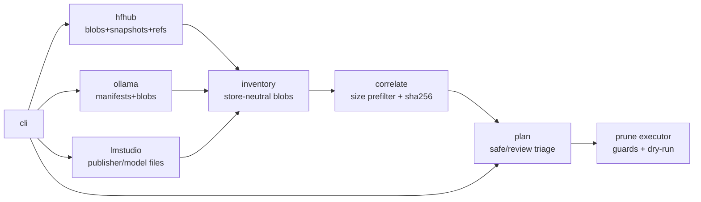

# weightsweep

[English](README.md) | [中文](README.zh.md) | [日本語](README.ja.md)

[](LICENSE) [](go.mod) [](CHANGELOG.md)  [](CONTRIBUTING.md)

**weightsweep：an open-source disk analyzer for Hugging Face, Ollama and LM Studio caches — it correlates blobs across all three stores by content hash, then turns the duplicates, orphans and stale revisions into a reviewable, safely executable prune plan.**


```bash
git clone https://github.com/JaydenCJ/weightsweep.git && cd weightsweep && go install ./cmd/weightsweep
```

> Pre-release: v0.1.0 is not yet published to a module proxy tag; install from source as above. A single static binary, no runtime dependencies, no network — weightsweep only ever reads your filesystem (and deletes exactly what an approved plan says).

## Why weightsweep?

Local-AI setups accumulate the same model three times without anyone noticing: the Hugging Face hub cache names LFS blobs by their sha256 under `models--org--name/blobs/`, Ollama stores the identical GGUF bytes as `blobs/sha256-…` layers, and LM Studio keeps a third copy as a plain file under `publisher/model/`. Each tool can, at best, inspect its own store — `hf cache scan` sees only the hub cache, `ollama list` only manifests — and none of them can tell you that 24 GiB of weights exist in triplicate, that a blob survived its last `ollama rm` because a shared manifest once pinned it, or that an old revision's snapshot still strands gigabytes after an update. weightsweep scans all three layouts, joins blobs by sha256 (free where the store names files by hash, computed only on size collisions elsewhere), and emits a prune plan whose every action is triaged **safe** (orphans, interrupted downloads, detached snapshot skeletons) or **review** (duplicate copies, stale-revision blobs) — dry-run by default, guarded against tampered paths and files that changed since planning.

| | weightsweep | hf cache scan / delete | ollama list / rm | du / ncdu |
| --- | --- | --- | --- | --- |
| Stores covered | HF hub + Ollama + LM Studio | HF hub only | Ollama only | any bytes, zero semantics |
| Cross-store duplicate detection | by sha256, size-prefiltered hashing | none | none | none |
| Orphaned blob detection | all three layouts | no (revisions only) | on `rm`, own store only | no |
| Stale HF revision handling | flagged + prunable, cascade explained | interactive delete-revisions | n/a | no |
| Deletion safety | plan file, dry-run default, size/root guards | immediate delete | immediate delete | manual `rm` |
| Corruption check | `--verify` re-hashes name-addressed blobs | no | no | no |

<sub>Comparison reflects upstream documentation as of 2026-07: huggingface_hub's `hf cache scan/delete` and Ollama's CLI each manage their own store; neither correlates content across tools.</sub>

## Features

- **One inventory across three cache layouts** — walks the HF hub structure (blobs / snapshots / refs), Ollama's OCI-style manifests + content-addressed blobs, and LM Studio's plain `publisher/model` trees into one store-neutral model.
- **Hash correlation that respects your disk** — HF LFS and Ollama blobs carry their sha256 in the filename (a readdir, not a read); everything else is hashed only when its exact byte size collides with another blob, so a lone 40 GiB GGUF is never touched.
- **Honest liveness classes** — every file is `live`, `stale` (only a detached HF revision links it), `orphan` (nothing references it) or `partial` (interrupted download), with the referencing models named.
- **Prune plans, not surprise deletions** — `plan` writes versioned JSON triaged into safe/review actions; `prune` is a dry run unless `--apply`, skips review actions unless `--include-review` or an explicit `--only ws-0007`, and refuses paths outside the recorded store roots or files whose size changed since planning.
- **Corruption detection built in** — `scan --verify` re-hashes every name-addressed blob and reports files whose bytes no longer match their claimed digest, correcting them before they can join a duplicate group.
- **Zero dependencies, zero network** — pure Go stdlib, one static binary; its own suite is 91 offline tests plus an end-to-end smoke script, and the repo intentionally ships no CI.

## Quickstart

Point it at your real caches (defaults: `$HF_HUB_CACHE` or `~/.cache/huggingface/hub`, `$OLLAMA_MODELS` or `~/.ollama/models`, `~/.lmstudio/models`) — or build the bundled demo tree first:

```bash
bash examples/make-demo-caches.sh
weightsweep --hf demo-caches/hf/hub --ollama demo-caches/ollama/models \
            --lmstudio demo-caches/lmstudio/models scan
```

Real captured output (from the demo tree):

```text
STORE        ROOT                                        MODELS  FILES  SIZE      RECLAIMABLE
huggingface  /home/user/lab/demo-caches/hf/hub           2       5      37.0 MiB  13.0 MiB
ollama       /home/user/lab/demo-caches/ollama/models    1       4      27.0 MiB  3.0 MiB
lmstudio     /home/user/lab/demo-caches/lmstudio/models  1       1      24.0 MiB  0 B
total                                                    4       10     88.0 MiB  16.0 MiB

duplicates: 1 group(s), 2 redundant copies, 48.0 MiB reclaimable by deduping
orphans:    2 file(s), 8.0 MiB · stale: 1 file(s), 8.0 MiB · partial: 2 file(s), 10 B
hashed 1 file(s) (24.0 MiB) to correlate size collisions
next: weightsweep plan --out plan.json && weightsweep prune --plan plan.json
```

Write the plan, review it, then apply — safe actions delete, review actions wait for explicit consent (real output, some rows elided):

```text
$ weightsweep --hf … plan --out plan.json
plan: 8 action(s), 64.0 MiB total
  safe:   5 action(s), 8.0 MiB (orphans, partials, stale skeletons)
  review: 3 action(s), 56.0 MiB (stale blobs, duplicate copies)
wrote plan.json

$ weightsweep --hf … prune --plan plan.json --apply
removed  ws-0001  safe    orphan-blob       5.0 MiB   …/hf/hub/models--acme--retired-model/blobs/3c6fe45e2ae3…
removed  ws-0003  safe    partial-download  7 B       …/hf/hub/models--acme--coder-2b/blobs/bc9a879d90ea…0000.incomplete
removed  ws-0005  safe    stale-revision    0 B       …/hf/hub/models--acme--coder-2b/snapshots/1111aaaa1111aaaa1111
skipped  ws-0006  review  duplicate         24.0 MiB  …/lmstudio/models/acme/coder-2b-GGUF/coder-2b-q4_k_m.gguf
                                                      ↳ review action; pass --include-review or --only ws-0006
freed 8.0 MiB across 5 action(s); 3 skipped, 0 failed
```

`dupes` and `orphans` give the same detail as focused reports, and every command takes `--json` for scripting.

## Classifications and safety levels

| Class | Meaning | Plan safety |
| --- | --- | --- |
| `live` | a ref'd HF revision, an Ollama manifest, or an LM Studio model dir references it | never planned |
| `orphan` | nothing references it (leftover layers, unlinked blobs) | `safe` |
| `partial` | interrupted download (`.incomplete`, `-partial`, `.tmp`, …) | `safe` |
| `stale` | only a detached HF revision (no ref) still links it | `review` |
| duplicate copy | same sha256 exists elsewhere; that tool would re-download on next use | `review` |

Deleting a stale snapshot skeleton demotes its blobs to orphans on the next scan — run `plan` again to collect them as safe actions (the cascade is deliberate: each step stays independently verifiable).

## Command and flag reference

| Key | Default | Effect |
| --- | --- | --- |
| `--hf`, `--ollama`, `--lmstudio` | env vars, then home-dir conventions | store roots to scan |
| `--hash` | `auto` | `auto` hashes only size collisions; `always` / `never` |
| `--min-size` | `0` | drop blobs below this size (`100MiB`, `1.5GiB`, …) from duplicate groups and plan actions |
| `scan --verify` | off | re-hash name-addressed blobs; corrupt files exit 1 |
| `plan --out` | stdout | where the plan JSON is written |
| `prune --plan` | required | plan to execute; dry run unless `--apply` |
| `prune --include-review` / `--only ID` | off | consent to review-level actions |

Exit codes: `0` ok · `1` findings need attention (corruption, prune failures) · `2` usage error.

## Architecture



The three scanners only read; the correlator hashes as little as it can; only the plan executor deletes, and only inside the roots the plan itself recorded.

## Roadmap

- [x] v0.1.0 — scan/dupes/orphans/plan/prune across HF hub, Ollama and LM Studio; sha256 correlation with size-collision prefilter; safe/review plan triage with guarded execution; `--verify` corruption check; JSON output; 91 tests + smoke script
- [ ] Hardlink/reflink dedupe mode: keep one copy, link the rest (same filesystem)
- [ ] GGUF header peek so duplicate groups can name quantization and parameter count
- [ ] Optional stores: llama.cpp download dirs, vLLM cache, GPT4All
- [ ] `plan --interactive` terminal picker for review actions
- [ ] Windows support (path conventions, LM Studio default locations)

See the [open issues](https://github.com/JaydenCJ/weightsweep/issues) for the full list.

## Contributing

Bug reports, cache-layout corrections and pull requests are welcome — see [CONTRIBUTING.md](CONTRIBUTING.md) for the local workflow (`go test ./...` plus `scripts/smoke.sh` printing `SMOKE OK`). Good entry points are labelled [good first issue](https://github.com/JaydenCJ/weightsweep/issues?q=is%3Aissue+is%3Aopen+label%3A%22good+first+issue%22), and design questions live in [Discussions](https://github.com/JaydenCJ/weightsweep/discussions).

## License

[MIT](LICENSE)
