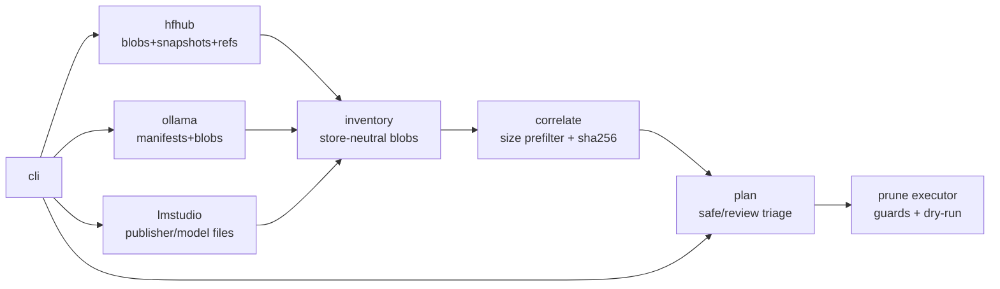

# weightsweep

[English](README.md) | [中文](README.zh.md) | [日本語](README.ja.md)

[](LICENSE) [](go.mod) [](CHANGELOG.md)  [](CONTRIBUTING.md)

**weightsweep：面向 Hugging Face、Ollama 与 LM Studio 缓存的开源磁盘分析器——按内容哈希在三个存储之间关联 blob，把重复、孤儿与失效版本整理成一份可审阅、可安全执行的清理计划。**


```bash
git clone https://github.com/JaydenCJ/weightsweep.git && cd weightsweep && go install ./cmd/weightsweep
```

> 预发布：v0.1.0 尚未发布 module proxy tag，请按上面方式从源码安装。单个静态二进制，零运行时依赖，零网络——weightsweep 只读取你的文件系统（删除的也只是已批准计划里写明的内容）。

## 为什么选 weightsweep？

本地 AI 环境会在无人察觉的情况下把同一个模型囤三份：Hugging Face hub 缓存把 LFS blob 以 sha256 命名放在 `models--org--name/blobs/` 下，Ollama 把字节完全相同的 GGUF 存成 `blobs/sha256-…` layer，LM Studio 又在 `publisher/model/` 下留一份普通文件。每个工具至多只能检视自己的存储——`hf cache scan` 只看 hub 缓存、`ollama list` 只看 manifest——没有谁能告诉你：24 GiB 的权重存了三份、某个 blob 因为曾被共享 manifest 引用而躲过了上次 `ollama rm`、或者更新之后旧版本的 snapshot 还搁浅着好几个 GiB。weightsweep 扫描全部三种布局，按 sha256 关联 blob（文件名即哈希的存储零成本，其余只在字节大小碰撞时才计算），并产出一份清理计划：每个动作都被分级为 **safe**（孤儿、中断下载、脱离的 snapshot 骨架）或 **review**（重复副本、失效版本 blob）——默认 dry-run，并防御被篡改的路径与规划后发生变化的文件。

| | weightsweep | hf cache scan / delete | ollama list / rm | du / ncdu |
| --- | --- | --- | --- | --- |
| 覆盖的存储 | HF hub + Ollama + LM Studio | 仅 HF hub | 仅 Ollama | 只见字节，不懂语义 |
| 跨存储重复检测 | 按 sha256，大小预筛选后哈希 | 无 | 无 | 无 |
| 孤儿 blob 检测 | 三种布局全覆盖 | 无（仅版本级） | 仅 `rm` 时、仅自身存储 | 无 |
| 失效 HF 版本处理 | 标记 + 可清理，级联有说明 | 交互式 delete-revisions | 不适用 | 无 |
| 删除安全性 | 计划文件、默认 dry-run、大小/根目录防护 | 立即删除 | 立即删除 | 手动 `rm` |
| 损坏检查 | `--verify` 重算按名寻址 blob | 无 | 无 | 无 |

<sub>对比基于 2026-07 各上游文档：huggingface_hub 的 `hf cache scan/delete` 与 Ollama CLI 各自只管理自己的存储，均不跨工具关联内容。</sub>

## 特性

- **三种缓存布局，一份清单** —— 把 HF hub 结构（blobs / snapshots / refs）、Ollama 的 OCI 风格 manifest + 内容寻址 blob、LM Studio 的普通 `publisher/model` 目录树，统一进一个与存储无关的模型。
- **体谅磁盘的哈希关联** —— HF LFS 与 Ollama 的 blob 文件名自带 sha256（一次 readdir，无需读文件）；其余文件只在字节大小与别的 blob 精确碰撞时才被哈希，孤零零的 40 GiB GGUF 永远不会被碰。
- **诚实的存活分类** —— 每个文件是 `live`、`stale`（只剩脱离的 HF 版本还链着它）、`orphan`（无任何引用）或 `partial`（中断下载），并列出引用它的模型名。
- **是清理计划，不是突然删除** —— `plan` 写出带版本号的 JSON，动作分级 safe/review；`prune` 不加 `--apply` 就是 dry-run，review 动作需要 `--include-review` 或显式 `--only ws-0007` 才执行，并拒绝越出计划记录的存储根目录的路径、以及规划后大小变化的文件。
- **内置损坏检测** —— `scan --verify` 重算每个按名寻址 blob 的哈希，报告字节与声称摘要不符的文件，并在其混入重复组之前先修正。
- **零依赖、零网络** —— 纯 Go 标准库，单个静态二进制；自身测试为 91 个离线用例外加端到端 smoke 脚本，仓库有意不带 CI。

## 快速上手

直接指向你的真实缓存（默认：`$HF_HUB_CACHE` 或 `~/.cache/huggingface/hub`、`$OLLAMA_MODELS` 或 `~/.ollama/models`、`~/.lmstudio/models`）——或先构建自带的演示目录树：

```bash
bash examples/make-demo-caches.sh
weightsweep --hf demo-caches/hf/hub --ollama demo-caches/ollama/models \
            --lmstudio demo-caches/lmstudio/models scan
```

真实捕获输出（来自演示目录树）：

```text
STORE        ROOT                                        MODELS  FILES  SIZE      RECLAIMABLE
huggingface  /home/user/lab/demo-caches/hf/hub           2       5      37.0 MiB  13.0 MiB
ollama       /home/user/lab/demo-caches/ollama/models    1       4      27.0 MiB  3.0 MiB
lmstudio     /home/user/lab/demo-caches/lmstudio/models  1       1      24.0 MiB  0 B
total                                                    4       10     88.0 MiB  16.0 MiB

duplicates: 1 group(s), 2 redundant copies, 48.0 MiB reclaimable by deduping
orphans:    2 file(s), 8.0 MiB · stale: 1 file(s), 8.0 MiB · partial: 2 file(s), 10 B
hashed 1 file(s) (24.0 MiB) to correlate size collisions
next: weightsweep plan --out plan.json && weightsweep prune --plan plan.json
```

写出计划、审阅、再执行——safe 动作删除，review 动作等待显式同意（真实输出，省略部分行）：

```text
$ weightsweep --hf … plan --out plan.json
plan: 8 action(s), 64.0 MiB total
  safe:   5 action(s), 8.0 MiB (orphans, partials, stale skeletons)
  review: 3 action(s), 56.0 MiB (stale blobs, duplicate copies)
wrote plan.json

$ weightsweep --hf … prune --plan plan.json --apply
removed  ws-0001  safe    orphan-blob       5.0 MiB   …/hf/hub/models--acme--retired-model/blobs/3c6fe45e2ae3…
removed  ws-0003  safe    partial-download  7 B       …/hf/hub/models--acme--coder-2b/blobs/bc9a879d90ea…0000.incomplete
removed  ws-0005  safe    stale-revision    0 B       …/hf/hub/models--acme--coder-2b/snapshots/1111aaaa1111aaaa1111
skipped  ws-0006  review  duplicate         24.0 MiB  …/lmstudio/models/acme/coder-2b-GGUF/coder-2b-q4_k_m.gguf
                                                      ↳ review action; pass --include-review or --only ws-0006
freed 8.0 MiB across 5 action(s); 3 skipped, 0 failed
```

`dupes` 与 `orphans` 以聚焦报告的形式给出同样的细节，所有命令都支持 `--json` 供脚本使用。

## 分类与安全级别

| 分类 | 含义 | 计划安全级 |
| --- | --- | --- |
| `live` | 被有 ref 的 HF 版本、Ollama manifest 或 LM Studio 模型目录引用 | 永不列入计划 |
| `orphan` | 无任何引用（遗留 layer、未链接的 blob） | `safe` |
| `partial` | 中断下载（`.incomplete`、`-partial`、`.tmp` 等） | `safe` |
| `stale` | 只剩脱离的 HF 版本（无 ref）还链接着它 | `review` |
| 重复副本 | 相同 sha256 存在于别处；对应工具下次使用时会重新下载 | `review` |

删除失效 snapshot 骨架后，它独占的 blob 会在下次扫描时降级为孤儿——再跑一次 `plan` 即可作为 safe 动作收走（这个级联是有意设计：每一步都可独立对照磁盘验证）。

## 命令与参数参考

| Key | Default | Effect |
| --- | --- | --- |
| `--hf`、`--ollama`、`--lmstudio` | 环境变量，其次 home 目录约定 | 要扫描的存储根目录 |
| `--hash` | `auto` | `auto` 只哈希大小碰撞项；另有 `always` / `never` |
| `--min-size` | `0` | 把小于该大小的 blob（`100MiB`、`1.5GiB` 等）排除出重复组与计划动作 |
| `scan --verify` | 关 | 重算按名寻址 blob；发现损坏则退出码 1 |
| `plan --out` | stdout | 计划 JSON 的写入位置 |
| `prune --plan` | 必填 | 要执行的计划；不加 `--apply` 即 dry-run |
| `prune --include-review` / `--only ID` | 关 | 对 review 级动作的同意 |

退出码：`0` 正常 · `1` 有需要关注的发现（损坏、清理失败） · `2` 用法错误。

## 架构



三个扫描器只读；关联器能少哈希就少哈希；只有计划执行器会删除，且只在计划自身记录的根目录之内。

## 路线图

- [x] v0.1.0 —— 覆盖 HF hub、Ollama、LM Studio 的 scan/dupes/orphans/plan/prune；带大小碰撞预筛选的 sha256 关联；safe/review 分级与防护执行；`--verify` 损坏检查；JSON 输出；91 个测试 + smoke 脚本
- [ ] 硬链接/reflink 去重模式：保留一份，其余做链接（同一文件系统）
- [ ] 读取 GGUF 头，让重复组能标出量化方式与参数量
- [ ] 可选存储：llama.cpp 下载目录、vLLM 缓存、GPT4All
- [ ] `plan --interactive` 终端交互式挑选 review 动作
- [ ] Windows 支持（路径约定、LM Studio 默认位置）

完整列表见 [open issues](https://github.com/JaydenCJ/weightsweep/issues)。

## 参与贡献

欢迎 bug 报告、缓存布局勘误与 pull request——本地工作流见 [CONTRIBUTING.md](CONTRIBUTING.md)（`go test ./...` 加上打印 `SMOKE OK` 的 `scripts/smoke.sh`）。入门任务标注为 [good first issue](https://github.com/JaydenCJ/weightsweep/issues?q=is%3Aissue+is%3Aopen+label%3A%22good+first+issue%22)，设计讨论在 [Discussions](https://github.com/JaydenCJ/weightsweep/discussions)。

## 许可证

[MIT](LICENSE)
